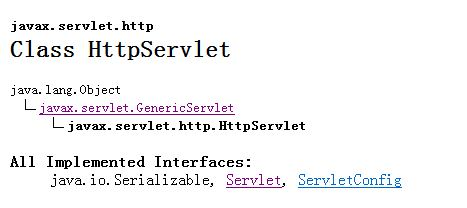

# 第三章 Servlet编程技术

----------
### 3.1.1 Servlet概念(page45)
- Servlet

	>**Servlet是一个标准的Java类，它的特殊之处是可以处理HTTP请求。**
- JSP与Servlet有什么关系？  

	> **JSP是以另一种方式实现的Servlet，Servlet是JSP的早期版本，在JSP中，更加注重页面的表现，而在Servlet中则更注重业务逻辑的实现。** 
	 
 

----------
### 3.1.2 Servlet的生命周期(page45)

- **init()方法：服务器初始化Servlet**
>**该方法描述为：**   
>**public void init(ServletConfig config)throws ServletException**  
>
>**当Servlet第一次被加载时，服务器调用init()方法初始化一个Servlet对象** 
>  
  
- **service()方法:初始化完毕，Servlet对象调用该方法响应客户端请求**
>**该方法描述为：**  
>**public void service(HttpServletRequest request, HttpServletResponse response)throws ServletException, IOException**  
>
>**service()方法可以被多次调用，每次用户请求都导致service()方法被调用，调用过程运行在不同的进程中，互不干扰** 
>  
   
- **destroy()方法：调用该方法消灭Servlet对象**
>**该方法描述为：**  
>**public void destroy()**  
>**当Servlet引擎终止服务时，比如关闭服务器等，destroy()方法会被执行，销毁Servlet对象。** 
>  

		总结：在整个Servlet的生命周期中，init()方法和destroy()方法都只被调用一次，
		而service()方法被调用多次。
  
### 3.3.2 GenericServlet类和HttpServlet类 (page51)

> **有上述继承树可知：GenericServlet是父类，它实现了Servlet接口中的service()方法，但它还是一个抽象方法，所有子类都应该实现这个方法。HttpServlet继承了GenericServlet类，自然也要实现service()方法。**

- service()方法
	- HttpServlet类有两种形式的service()方法：public 和 protected，描述如下：
	
		>**public void service(ServletRequest request, ServletResponse response) throws ServletException, IOException**  

		>**protected void service(HttpServletRequest request, HttpServletResponse response) throws ServletException, IOException** 
	- 当包容器为一个Servlet收到一个请求时，这个方法的调用顺序是：
	
		>1. **包容器调用public的service()方法；**
		>2. **在把参数分布转换为HttpServletRequest和HttpServletResponse后，public的service()方法调用protected的service()方法；**
		>3. **根据HTTP请求方法的类型，protected的service()调用doXXX()方法之一。** 

	#####注意：常用的doXXX()方法有doGet()和doPost()，我们编写的Servlet类继承HttpServlet之后，只需要覆盖doGet()或doPost()方法即可，不需要覆盖service()方法。