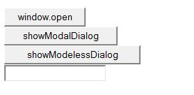
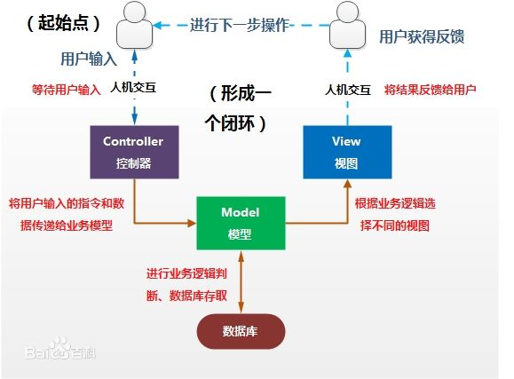

# 第六章 JSP经典开发技巧
----------
### 6.1.2 三种网页对话框(page115)
* 使用window.open打开的网页
* 使用Web模式对话框
* 使用Web非模式对话框  

> **三种对话框的区别是：利用window.open打开的页面和其他的窗口一样，可以在几个窗口之间切换；模式对话框不可以和其他窗口切换焦点，只能是当前窗口。非模式对话框可以和其他对话框切换焦点，但是永远在屏幕的最前面。**

----------
### 6.7 面向对象设计模式(page150)
>**注：本节老师没划重点，但在课上有讲到，高分者可详看。**

- Factory模式
- Singleton模式
- mvc架构模式

